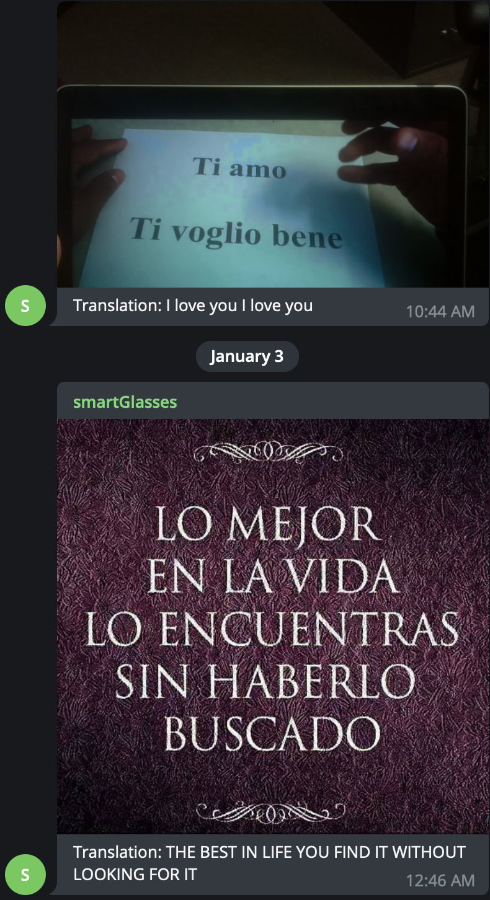

# smart-glasses

This project implements image recognition along with text recognition and translation for a pair of smart glasses built with a raspberry pi zero

## Getting Started

These instructions will get you a copy of the project up and running on your local machine for testing purposes.

### Prerequisites

- A working command line
- A Google Cloud Services account
  - A JSON account token with access to the Cloud Vision API and the Cloud Translation API
- A Telegram JSON token (This part can be skipped if you wish to exclude the telegram functionality)

### Installing and Running

Download the zip then create a virtual environment and install the dependencies from requirements.txt 

Make sure you have `virtualenv`

```console
foo@bar:~$ pip3 install virtualenv
```

Navigate to the correct directory then create and source a virtual environment and install the dependencies

```console
foo@bar:~$ cd /path/to/directory/here
foo@bar:~$ virtualenv venv
foo@bar:~$ source venv/bin/activate
(venv) foo@bar:~$ pip install -r requirements.txt
```

At this point, make sure you have the appropriate JSON files and/or comment out the undesired functionality. Finally, execute the program. (main.py includes full functionality to take a picture and process it while visionAPI.py uses pictures from the images directory)

Demo

```console
(venv) foo@bar:~$ python visionAPI.py
Translation: THE BEST IN LIFE YOU FIND IT WITHOUT LOOKING FOR IT
200
High Performance MPEG 1.0/2.0/2.5 Audio Player for Layer 1, 2, and 3.
Version 0.3.2-1 (2012/03/25). Written and copyrights by Joe Drew,
now maintained by Nanakos Chrysostomos and others.
Uses code from various people. See 'README' for more!
THIS SOFTWARE COMES WITH ABSOLUTELY NO WARRANTY! USE AT YOUR OWN RISK!

Playing MPEG stream from output.mp3 ...
MPEG 2.0 layer III, 32 kbit/s, 24000 Hz mono

[0:04] Decoding of output.mp3 finished.
```

Example Telegram output



## Authors

* **Michael Roush** - *visionAPI.py*
* **Jonathan Williams** - *additions to main.py*

## License

Copyright © 2019 Michael Roush. All rights reserved.

